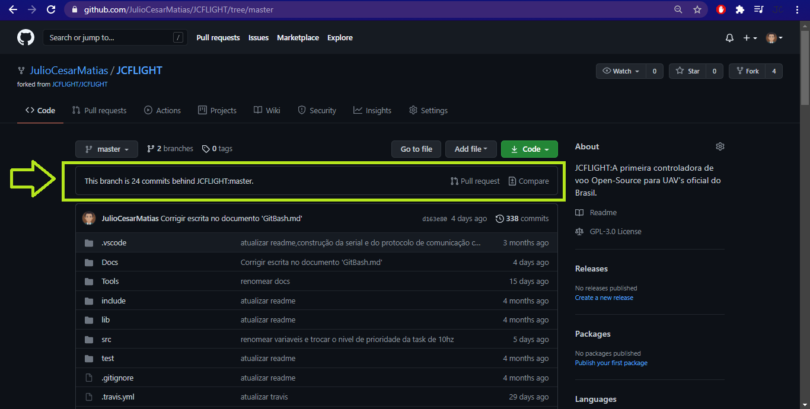
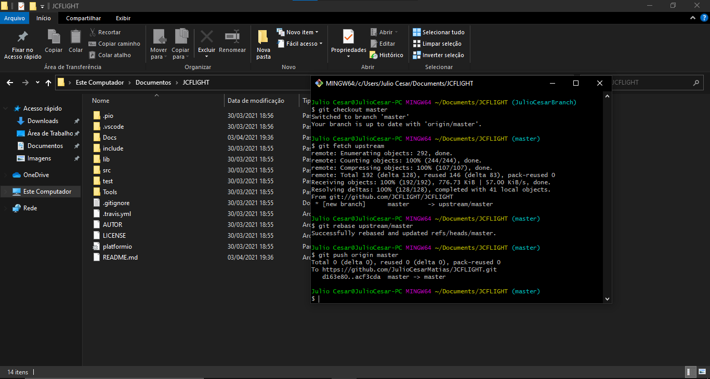
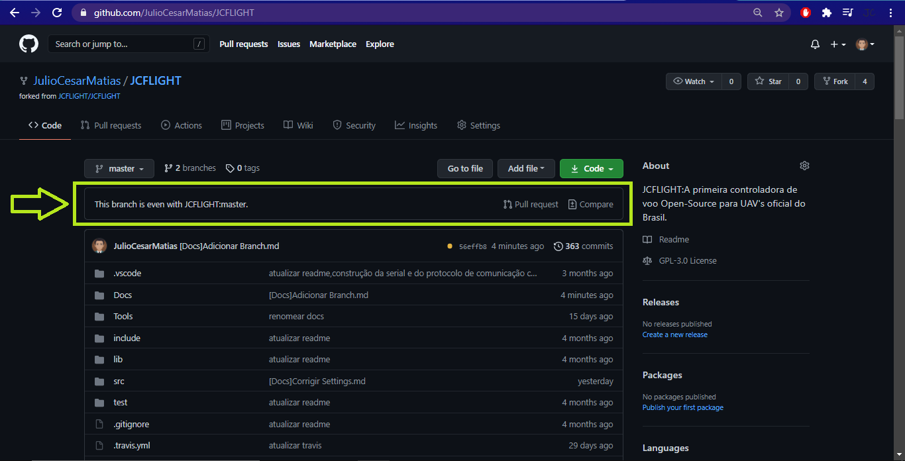

# Como deixar a sua Branch sincronizada com o master

Documento apenas para desenvolvedores.

## Sincronizando a sua Branch

- Após fazer o `Fork` do repositório da JCFLIGHT,você notará que o GitHub não sincroniza a sua Branch automáticamente,e para fazer Pull-Requests é necessário deixar sua Brach atualizada,para fazer isso nós vamos utilizar o Terminal do GitBash e alguns poucos comandos.

- Exemplo da Brach desatualizada:

## Entrando com os comandos no GitBash

- A primeira coisa é ir no local da sua máquina onde você clonou o repositório e abrir a pasta,e dentro da mesma,abrir o terminal do GitBash e digitar os comando abaixo:

- `git checkout master`
- `git fetch upstream`
- `git rebase upstream/master`
- `git push origin master`

- Exemplo da Brach Atualizada:

