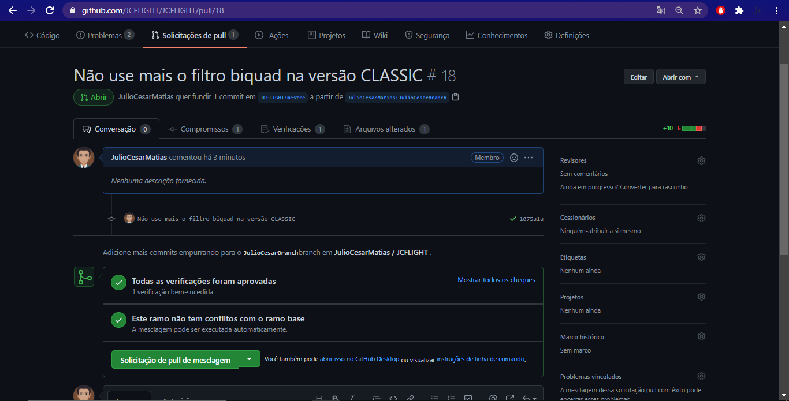

# Do Clone ao Pull-Request

Documento apenas para desenvolvedores.

## Forkando o repositório

- A primeira coisa que você deve fazer é `Forkar(Garfo)` o repositório para o seu GitHub,acesse o [repositório da JCFLIGHT](https://github.com/JCFLIGHT/JCFLIGHT) e faça o Fork.

- Após o fork,o repositório irá aparecer na sua conta de usuario do GitHub,onde você irá usar para Clonar e fazer alterações para o Pull-Request (tomando cuidado com a licença sob a qual ele foi liberado).

## Clonando o repositório

- Agora você precisa baixar os arquivos do repositório para que você possa alterar.A primeira coisa a fazer é copiar a URL do repositório.

- Após copiar a URL,abra o terminal do GitBash,crie um diretório onde você vai guardar o projeto,e digite `git clone` e após esse comando coloque o link do seu fork e aperte enter.Pronto agora temos o projeto da JCFLIGHT clonado dentro da nossa maquina local.

## Criando a Branch para codar

- Quando você fizer alguma alteração,seja ela por correção de bug ou melhoria,você deverá criar uma branch para enviar o seu projeto modificado para que ele seja mesclado com o projeto do repositório oficial da JCFLIGHT.

1. Vá até o local que você clonou o repositório da JCFLIGHT e abra o terminal do GitBash.
2. Verifique primeiro se você está na Branch Master,digitando o comando `git branch`,o terminal tem que te retornar `* master`.
3. Agora vamos criar a Branch,usando o comando `git checkout -b`,após o `-b` você deve colocar um nome para a sua Branch,por exemplo:`git checkout -b JulioCesarBranch`.
4. Agora é a hora de enviar suas alterações,usando os comandos `git add --all` e `git commit -m "Coloque aqui o titulo"`,nas aspas depois do `-m` você deve escrever o titulo do commit,após esses dois comandos,vamos dar o último comando para subir as alterações para o seu repositório Forkado,usando o comando `git push origin` após o `origin` você deve colocar o nome o nome da sua Brach,que nesse exemplo eu nomeiei de `JulioCesarBranch`.

## Comparando e Pull-Request

- Após fazer o que foi descrito acima,acesse o [repositório](https://github.com/JCFLIGHT/JCFLIGHT) original da JCFLIGHT no GitHub,e você verá uma mensagem como essa:

- Agora você irá confirmar e corrigir o titulo do Pull-Request e se necessario adicionar uma descrição com mais precisão do que você fez nas alterações.Quando você achar que tudo está correto,você irá clicar em `Create pull request`.

- Agora o Pull-Request irá ser aberto no repositório oficial da JCFLIGHT e ele irá ser verificado pelo CircleCI em conjunto com o TravisCI,basimente o seu algoritimo irá ser compilado para verificar se existe erros.A verificação irá demorar alguns minutos.

- Se a verificação passar,você irá receber a mensagem de que as verificações foram aprovadas,como na imagem abaixo:

- Agora você deve esperar com que algum administrador veja o PR,e revise o mesmo,se tudo estiver OK,o mesmo será mesclado.Quando o seu PR for mesclado,ele irá aparecer a mensagem de que o PR foi mesclado e fechado.

