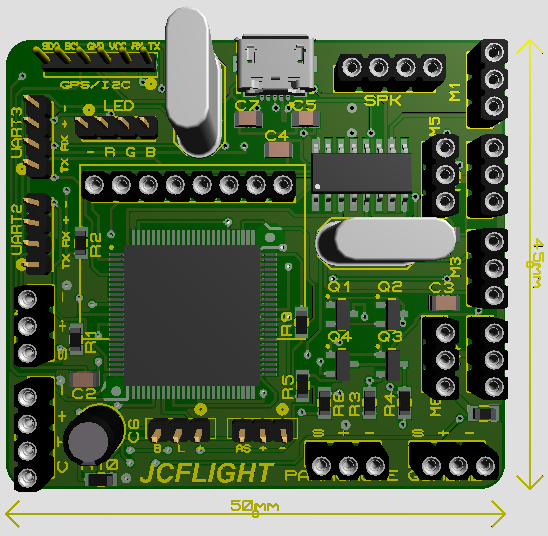
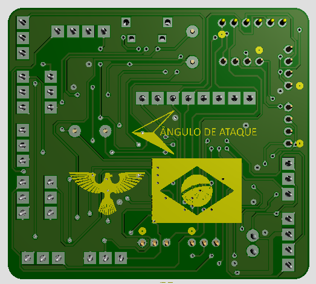

## Se você for novato com a JCLIFHT,leia a Wiki,ou acesse o YouTube

## Suporte JCFLIGHT
Se você gostaria de apoiar o desenvolvimento da JCFLIGHT,sinta-se à vontade para fazer uma doação.Isso nos ajuda a comprar hardware para portabilidade,desenvolvimento e prototipagem.  

Travis-CI Dashboard: [travis-ci.com/JCFLIGHT/JCFLIGHT](https://travis-ci.com/JCFLIGHT/JCFLIGHT)

JCFLIGHT é um software de piloto automático de código aberto,ele está em desenvolvimento desde 2018.Este software de piloto automático é capaz de controlar alguns sistemas de veículos,tais como:Multirotores,Aeromodelos Convencionais,Aeromodelos do tipo V-Tail e Asa-Fixa.

| Status | Microcontrolador | Nome | Versão | Notas |
| :----: | :-------: | ---- | :-----: | :---- |
| :heavy_check_mark:  | ATmega2560 | JCFlight-Classic | *0.0.0* | Em construção |
| :x:  | Stm32F407ve | JCFlight-Pascal | *0.0.0* | Construção não iniciada |
| :x:  | Esp32 | JCFlight-Extrene | *0.0.0* | Em construção |

## Licença

O projeto JCFLIGHT está licenciado sob a GNU General Public License,versão 3.

Repositório Github: https://github.com/JCFLIGHT/JCFLIGHT

## Mantenedor

[Julio Cesar Matias](https://github.com/JulioCesarMatias) - Mantenedor do Firmware e do [GCS da JCFLIGHT](https://github.com/JCFLIGHT/JCLFIGHTGCS).                                                      
**Plataformas**: Multirotores,Aeromodelos e Asa-Fixa.                                                                    
**Placas**: JCFlight-Classic,JCFlight-Pascal e JCFlight-Extreme

## Como construir

- Baixe e instale o VSCode clicando [aqui](https://visualstudio.microsoft.com/pt-br/downloads/).
- Baixe e instale a extensão do PlatformIO clicando [aqui](https://platformio.org/platformio-ide) ou através do gerenciador de extensões do próprio VSCode.
- Baixe esse projeto da JCFLIGHT,você pode baixar direto aqui do GitHub,ou clonar pelo terminal do GitBash,eu recomendo clonar,clique [aqui](https://github.com/JCFLIGHT/JCFLIGHT/blob/master/Docs/GitBash.md) para aprender a clonar o repositório.
- Abra o VSCode.
- Abra a pasta do projeto da JCFLIGHT com o VSCode.
- Abra o "platformio.ini" e altere a porta COM para sua respectiva,afim de compilar.

## Como contribuir

- Clique [aqui](https://github.com/JCFLIGHT/JCFLIGHT/blob/master/Docs/Development.md) para ler a orientação de desenvolvimento.
- Caso você encontre algum bug,abra um Issue clicando [aqui](https://github.com/JCFLIGHT/JCFLIGHT/issues).
- Caso você deseja enviar alguma melhoria feita para o algoritimo,faça um Pull-Request.
- Clique [aqui](https://github.com/JCFLIGHT/JCFLIGHT/blob/master/Docs/GitBash.md) para aprender a clonar o repositório e abrir Pull-Request.
- Clique [aqui](https://github.com/JCFLIGHT/JCFLIGHT/blob/master/Docs/Branch.md) para aprender a deixar sua Branch atualizada com o Master.

## Fotos

