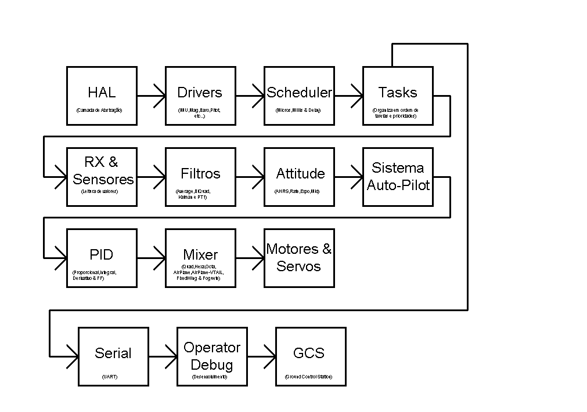
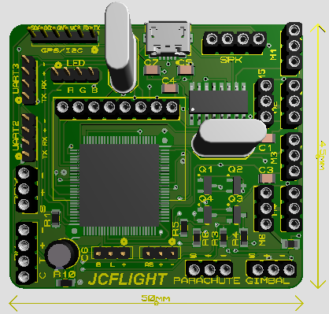
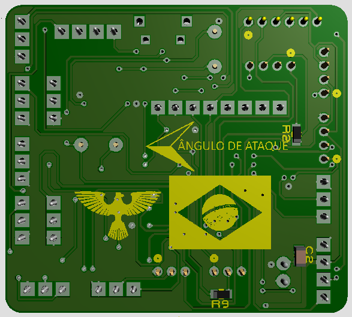

Travis-CI Dashboard: [travis-ci.com/JCFLIGHT/JCFLIGHT](https://travis-ci.com/JCFLIGHT/JCFLIGHT)

JCFLIGHT é um software de piloto automático de código aberto.Ele está em desenvolvimento desde 2018 por um único desenvolvedor.Este software de piloto automático é capaz de controlar alguns sistemas de veículos,tais como,Multirotores,Aeromodelos Convencionais,Aeromodelo do tipo V-Tail e Asa-Fixa.

| Status | Microcontrolador | Nome | Versão | Notas |
| :----: | :-------: | ---- | :-----: | :---- |
| :heavy_check_mark:  | ATMEGA2560 | JCFLIGHT-CLASSIC | *0.0.0* | Em construção |
| :x:  | STM32F407VE | JCFLIGHT-PASCAL | *0.0.0* | Construção não iniciada |
| :heavy_check_mark:  | ESP32 | JCFLIGHT-EXTREME | *0.0.0* | Em construção |

## Licença

O projeto JCFLIGHT está licenciado sob a GNU General Public License,versão 3.

Repositório Github: https://github.com/JCFLIGHT/JCFLIGHT

## Contribuidor

[Julio Cesar Matias](https://github.com/JuliooCesarMDM)                                                        
**Veículo**: Multirotores,Aeros & Asa-Fixa.                                                                    
**Plataformas**: JCFLIGHT-CLASSIC,JCFLIGHT-ZION,JCFLIGHT-PASCAL & JCFLIGHT-EXTREME

## Como construir

- Baixe e instale o VSCode clicando [aqui](https://visualstudio.microsoft.com/pt-br/downloads/).
- Baixe e instale a extensão do PlatformIO clicando [aqui](https://platformio.org/platformio-ide) ou através do gerenciador de extensões do próprio VSCode.
- Baixe e abra o projeto da JCLIGHT.
- Abra o "platformio.ini" e altere a porta COM para sua respectiva,afim de compilar.

## Como contribuir

- Caso você encontre algum bug,abra um Issue clicando [aqui](https://github.com/JCFLIGHT/JCFLIGHT/issues).
- Caso você deseja enviar alguma melhoria feita para o algoritimo,faça um Pull-Request.

## Fotos

